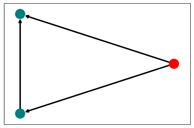

# 2021-Yousaf-Raeesa

## Introduction

### Project Idea
Role discovery arose in social sciences as means to explain specific functions of people in society by assigning them roles such as teacher, student, parent, etc. Naturally role discovery has become important to network analysis in general and is being used to explore behaviour and structures in different settings such as technological networks (detecting anomalies in IP traces) and biological networks (roles of proteins in different compounds) and many more.

Role are important to potentially identify anomalies within a group or target certain groups based on their role in a network.
The main idea of this project was to create a network out of data on Twitter users and mentions and apply graph role discovery algorithms to see if any interesting roles or structures were detected. 

The node of the network are Twitter users, and the edges are mentions, creating a directed graph showcasing (i.e., if user1 mentions user2 there would be an edge from user1 to user2).

Note: The terms graph and network are used interchangeably.

### Short Introduction to Graph Role Discovery
Intuitively, role discovery or extraction takes a graph and divides the nodes into classes of structurally similar nodes. Nodes are considered structurally similar if they are connected to the rest of the network in almost identical ways. Depending on the definition of structurally similar in relation to one's project, role discovery can unearth connectivity patterns (such as stars, bridges, cliques). 

Local role discovery can be applied to a broader scale and describe behaviour in graphs with similar underlying processes and conditions.
Factors that can be considered for structural similarity are degree centrality and number of triangles to which nodes belong. 

Not to confuse community discovery, which discovers subgroups that are densely connected, roles represent nodes that are structurally similar and are spread across the network. In fact, one could say that role discovery includes community discovery as structures such as stars and cliques can be found.

 
Fig. 1: Example of graph with roles, each role with a different colour

This shows that roles discovery is not the same as community discovery, nodes of the same role do not need to be connected or in the same vicinity.

Role discovery methods are primarily graph-based and feature-based. Graph-based methods partition nodes into disjoint subgroups based on a specified criterion and always take connectivity patterns into account to refine node roles. 
Feature-based methods focus on local connectivity patterns of nodes and their neighbours and create a feature vector for each node using attribute features. Of course, there are also hybrid discovery methods that combined the two and yield interesting results.

As for the graph role discovery algorithms, there are several to choose from. The algorithm chosen for this project was ReFeX (Recursive Features Extraction) since there was enough research and a few public implementations to work with. ReFeX is feature-based, node features (e.g., degree, neighbours, number of internal vs. external edges) are recursively aggregated over the node's neighbours until no additional information can be found/extracted.

For further reading, see references [[1]](#1), [[2]](#2), [[3]](#3)

## Implementation
The main language used for network analysis is NetworkX because the syntax allows more clarity for the reader and the construction of egographs is much easier compared to igraph. Using NetworkX or igraph has no impact on the computation time of the feature extraction or role assignment.

The [implementation of the ReFeX algorithm](https://github.com/dkaslovsky/GraphRole)) is a library and can be installed using pip install.
For other libraries and requirements, see [requirements](https://git-dbs.ifi.uni-heidelberg.de/practicals/2021-yousaf-raeesa/-/blob/main/requirements).

The data containing information on Twitter users and their mentions looks like the following:

 
In our analysis, the timestamp column is irrelevant, what is very important is to create a directed graph where username1 points to username2. This means that username1 has mentioned username2 in a Tweet. If the graph is not directed then accurate results and analysis cannot be performed, since the data is not being constructed and displayed properly. 

The feature extraction and role assignment are quite straightforward, instructions as well as further reading can be found in the GitHub repository providing the ReFeX implementation.
Feature extraction and role assignment are done in two separate steps and result in a list of all nodes in the graph with their assigned role as well as their node role percentage – each node is part of several roles in varying degrees, their highest percentage membership to a role assigns them.

Additionally, a colour palette can be constructed assigning a unique colour to each role for a visual summary.
However, whilst the algorithm may assign roles and deliver a list of nodes and their respective roles, it does not characterize each role. Meaning, as of now, one must manually verify the characteristics of each role and determine its properties. In a small network, this can be easily done, whereas in a larger network such as the Twitter network with about 4000 nodes it is near impossible to manually check each node and discover its properties.

## Results
### Detected Roles
A total of eight roles were discovered in the twitter network. As mentioned, the characteristics of each role had to be manually checked and derived, so as of now the results are estimations.

In the following graph, the red node is the node of interest assigned the role being described, the green nodes are its neighbours.

Nodes assigned role_0 have no outgoing edges (k_out = 0) and are classified as sink nodes. This means that these users are being mentioned by others but are not active themselves.

Nodes assigned role_1 are mostly connected to nodes assigned role_2 which are stars. This was one of the more difficult roles to characterise and needs further investigation.

Nodes assigned role_2 are at the centre of stars. These are structures that show up in graphs and have a star-like shape.

Nodes assigned role_3 have no ingoing edges (k_in = 0) and are classified as source nodes. These nodes in particular act as bridges and connect structures such as cliques and stars.

Nodes assigned role_4 are mostly connected to role_2 and role_1 nodes which means they are possibly connected to stars. Along with role_1, this was a difficult group to characterize.

Nodes assigned role_5 are also source nodes and are part of triangles, which are structures that show up in graphs.

Nodes assigned role_6 have exactly one outgoing edge (k_out = 1). These source nodes are users that mentions exactly one other user.

 Nodes assigned role_7 are part of cliques, a densely connected group of nodes. This mean that users part of a clique interact a lot with each other and rarely with anyone outside of the clique.

### Comparison to Random Networks
To check the validity of the algorithm and the roles as well as perhaps find out when a role is classified as such, the idea was to compare role discover in a well-defined and motivated network such as the Twitter network with role discovery in a random network.
The prediction was that if roles were to be discovered in the random network, they would not be easily characterizable and distinct from one another. 

For a somewhat fair comparison, a random network with the same number of nodes and a similar average degree as the Twitter network was constructed and analysed.
The initial – or rather intuitive – prediction was correct: The only nodes identified were source nodes (k_in = 0) and otherwise no distinct patterns were recognizable. Also, the distribution of nodes among roles was quite even, whereas about half the nodes in the Twitter network were assigned to role_0.

After this initial comparison, the next step was to analyse and compare the results of the two networks mathematically, to perhaps find some mathematical background and threshold as to when a role is classified as such.
For this, the node role percentage values were compared for both networks. In particular, the maximum and 75th percentile values were observed. The maximum values (blue column) for the Twitter network are very high, indicating that nodes are more unique and can be definitively assigned to a role. The expectation for the random network, was that the maximum values (orange column) would be lower and all the same. This was surprisingly not the case. Also, interestingly the 75th percentile values for the Twitter network (grey column) were all the same, whereas they fluctuated for the random network (yellow network).

 
A similarity comparison using cosine similarity yielded results of about 98% for both maximum and 75th percentile values.
The mathematical comparison was surprising and why the results are the way they are is not known yet. It is important to further research role discovery in random networks and see why this behaviour occurs.

### Analysis of specific nodes
The Twitter users in the data used for this project were mostly politically affiliated accounts. So, it was interesting to look at a few specific users and see if they showed anything interesting.

CDU – Armin Laschet (role_0)

SPD – Olaf Scholz (role_0)

Die Gruenen – Anna Lena Baerbock (role_0)

AfD – Alice Weidel (role_0)

FDP – Christian Lindner (role_7)

Die Linke – Dietmar Bartsch (role_4)
 
The graphs show the egographs of leaders of Germany’s main political parties.
There are quite a few interesting observations to be made here:
* The graphs of the leaders of Germany’s three largest parties (CDU, SPD, Die Gruenen) are very large. These nodes have many neighbours
* The graphs of the leaders of the other parties are noticeably sparser, with fewer people interacting with these people
* Most nodes are assigned role_0. These leasers are being mentioned by others but are not active themselves. In particular, the leaders of the three big parties are mentioned by a myriad of people, whereas AfD’s Alice Weidel is mentioned by just a few people.
* Another interesting person is FDP’s Christian Lindner, who is part of a clique. The members of this clique are mostly FDP affiliated accounts
* Die Linke’s Dietmar Bartsch has few neighbours and also interacts with mostly Die Linke affiliated accounts.

All in all, it is interesting to note how role discovery can be used as means for political analysis. Observing the social media presence and behaviour of politicians as well perhaps predicting or orchestrating changes are interesting topics to analyse. 

## Outlook
It is important to extend the library for graph role discovery and add means to characterize the roles without the user having to manually check themselves. This is important when examining larger networks and verifying each role exactly. 
Also as mentioned, a deeper analysis on role discovery in random networks would be important. And of course, further analysis of political users and the occurrence of certain structures in the graph would be very interesting topics to observe as well as how this behaviour might change over time.

### References
<a id="1">[1]</a> 
R. A. Rossi; N. K. Ahmed (2014). 
[Role Discovery in Networks](https://ieeexplore.ieee.org/document/6880836/citations)

<a id="2">[2]</a> 
P. V. Gupte; B. Ravindran; S. Parthasarathy (2017)
[Role Discovery in Graphs Using Global Features: Algorithms, Applications and a Novel Evaluation Strategy](https://ieeexplore.ieee.org/document/7930024)

<a id="3">[3]</a> 
K. Henderson, B. Gallagher (2012)
[RolX: structural role extraction & mining in large graphs](https://dl.acm.org/doi/abs/10.1145/2339530.2339723)

